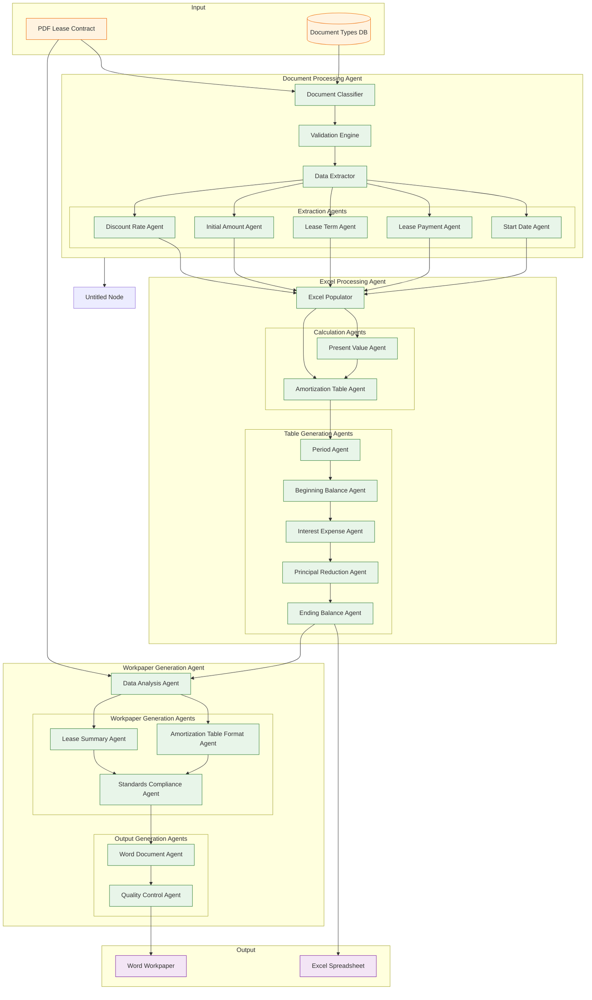

### Architecture

```mermaid
flowchart TD
 subgraph Input["Input"]
        PDF["PDF Lease Contract"]
        DT[("Document Types DB")]
  end
 subgraph ExtractionAgents["Extraction Agents"]
        DR["Discount Rate Agent"]
        IA["Initial Amount Agent"]
        LT["Lease Term Agent"]
        LP["Lease Payment Agent"]
        SD["Start Date Agent"]
  end
 subgraph DocumentAgent["Document Processing Agent"]
        DC["Document Classifier"]
        VE["Validation Engine"]
        DE["Data Extractor"]
        ExtractionAgents
  end
 subgraph CalculationAgents["Calculation Agents"]
        PVC["Present Value Agent"]
        ATC["Amortization Table Agent"]
  end
 subgraph AmortizationAgents["Table Generation Agents"]
        PG["Period Agent"]
        BBG["Beginning Balance Agent"]
        IEG["Interest Expense Agent"]
        PRG["Principal Reduction Agent"]
        EBG["Ending Balance Agent"]
  end
 subgraph ExcelAgent["Excel Processing Agent"]
        EP["Excel Populator"]
        CalculationAgents
        AmortizationAgents
  end
 subgraph WorkpaperAgents["Workpaper Generation Agents"]
        LS["Lease Summary Agent"]
        AT["Amortization Table Format Agent"]
        SC["Standards Compliance Agent"]
  end
 subgraph OutputAgents["Output Generation Agents"]
        WD["Word Document Agent"]
        QC["Quality Control Agent"]
  end
 subgraph WorkpaperAgent["Workpaper Generation Agent"]
        DA["Data Analysis Agent"]
        WorkpaperAgents
        OutputAgents
  end
 subgraph Output["Output"]
        WP["Word Workpaper"]
        ES["Excel Spreadsheet"]
  end
    PDF --> DC & DA
    DT --> DC
    DC --> VE
    VE --> DE
    DE --> DR & IA & LT & LP & SD
    DR --> EP
    IA --> EP
    LT --> EP
    LP --> EP
    SD --> EP
    EP --> PVC & ATC
    PVC --> ATC
    ATC --> PG
    PG --> BBG
    BBG --> IEG
    IEG --> PRG
    PRG --> EBG
    EBG --> DA & ES
    DA --> LS & AT
    LS --> SC
    AT --> SC
    SC --> WD
    WD --> QC
    QC --> WP
    DocumentAgent --> n1["Untitled Node"]

     PDF:::data
     DT:::data
     DC:::subagent
     VE:::subagent
     DE:::subagent
     DR:::subagent
     IA:::subagent
     LT:::subagent
     LP:::subagent
     SD:::subagent
     EP:::subagent
     PVC:::subagent
     ATC:::subagent
     PG:::subagent
     BBG:::subagent
     IEG:::subagent
     PRG:::subagent
     EBG:::subagent
     DA:::subagent
     LS:::subagent
     AT:::subagent
     SC:::subagent
     WD:::subagent
     QC:::subagent
     WP:::data
     WP:::output
     ES:::data
     ES:::output
    classDef agent fill:#e1f5fe,stroke:#01579b
    classDef subagent fill:#e8f5e9,stroke:#2e7d32
    classDef data fill:#fff3e0,stroke:#ef6c00
    classDef output fill:#f3e5f5,stroke:#7b1fa2
```
